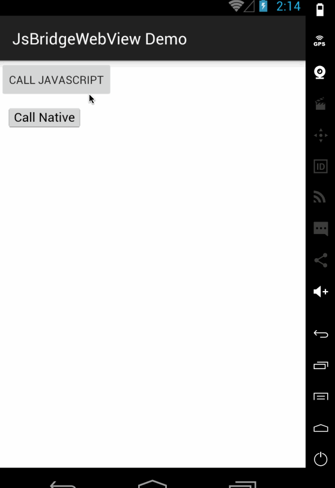

# JsBridgeWebView

Android bridge for sending messages between Java and JavaScript

# Screenshot



# Setup

* In your `build.gradle` :

```gradle
repositories {
    maven { url "https://jitpack.io" }
}

dependencies {
    compile 'com.github.nanjingboy:JsBridgeWebView:1.3.0'
}
```

# Usage

* Add JsBridgeWebView in your layout file

```xml
<me.tom.jsbridgewebview.JsBridgeWebView
    android:id="@+id/webView"
    android:layout_width="match_parent"
    android:layout_height="match_parent"/>
```

* In your activity file

```java
JsBridgeWebView webView = (JsBridgeWebView) findViewById(R.id.webView);

/**
 * register java handler
 */
webView.registerHandler("callNative", new JsBridgeNativeHandler() {
    @Override
    public void handler(Object data, JsBridgeNativeCallBack callBack) {
        Log.d("Request from JavaScript:", data.toString());
        try {
            JSONObject response = new JSONObject();
            response.put("message", "Response from Java");
            callBack.onCallback(response);
        } catch (JSONException e) {
        }
    }
});

/**
 * call javaScript handler
 */
JSONObject data = new JSONObject();
data.put("message", "Request from Java");
webView.callHandler("callJavaScript", data, new JsBridgeJsCallbackHandler() {
    @Override
    public void handler(Object data) {
        Log.d("Response from JavaScript:", data.toString());
    }
});
```

* In your javaScript file

```javascript
function setupJsBridgeWebView(callback) {
  if (window.jsBridgeWebView) {
    callback(window.jsBridgeWebView);
  } else {
    document.addEventListener(
      'jsBridgeWebViewReady',
      function() {
        callback(window.jsBridgeWebView);
      },
      false
    );
  }
};

/**
 * register javaScript handler
 */
setupJsBridgeWebView(function(bridge) {
  bridge.registerHandler("callJavaScript", function(data, callback) {
      alert(JSON.stringify(data));
      callback({"message": "Response from JavaScript"});
  });
});

/**
 * call java handler
 */
setupJsBridgeWebView(function(bridge) {
  bridge.callHandler("callNative", {"message": "Request from JavaScript"}, function(response) {
     alert(JSON.stringify(response));
  });
});
```


* [Sample](sample/src/main)

# License

MIT